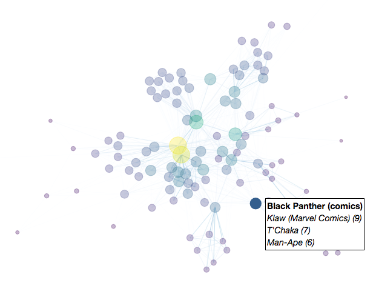

# WikiNetworking

### Introduction

This project consists of two Jupyter notebooks that crawl Wikipedia articles and text mine them for links to build a node graph representation of the relationships between articles.

###  Notebooks

[Wiki Networking - Text Mining Tools.ipynb](Wiki%20Networking%20-%20Text%20Mining%20Tools.ipynb) contains text mining and web crawling code for retrieving link data from Wikipedia pages. [`./mcu_network.json`](./mcu_network.json) is an example of json data generated from a web crawl for a network of characters in the Marvel Cinematic Universe. 

[Wiki Networking.ipynb](Wiki%20Networking.ipynb) contains an example of how to load the result of a Wikipedia crawl and create a weighted node graphs that can be interactive or high resolution. [`./mcu_network_large.png`](./mcu_network_large.png) is a high resolution (14400 x 10800) render of the data from [`./mcu_network.json`](./mcu_network.json).

### Requirements

- [`jupyter`](https://pypi.python.org/pypi/jupyter)
- [`matplotlib`](https://pypi.python.org/pypi/matplotlib)
- [`networkx`](https://pypi.python.org/pypi/networkx)
- [`pyquery`](https://pypi.python.org/pypi/pyquery)
- [`mpld3`](https://pypi.python.org/pypi/mpld3)
